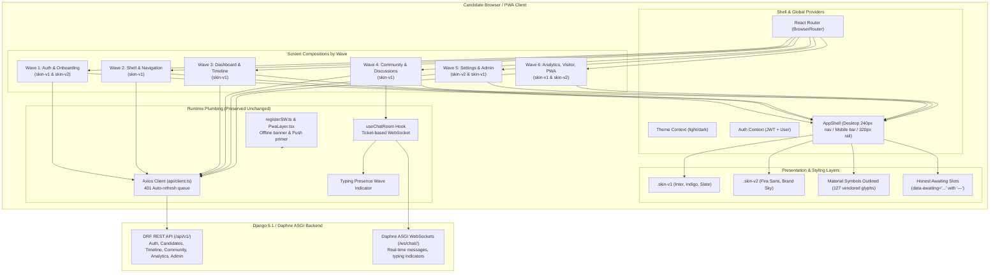

# Phase 16: replace the current screens with the frontend/stitch designs - Research

**Researched:** 2026-10-04  
**Domain:** Frontend UI / Stitch Design System / React 18 / Tailwind CSS v4 / Material Symbols  
**Confidence:** HIGH  

<user_constraints>
## User Constraints (from CONTEXT.md)

### Locked Decisions
- **D-01: Exact Stitch markup and structure** — The application's screens are replaced to match the exact visual presentation, markup, element hierarchy, classes, and layout from the 45+ compositions in `frontend/stitch designs/`. The two skins (`skin-v1` with Inter, indigo/slate palette and `skin-v2` with Fira Sans/Fira Code, brand/sky palette) are preserved and scoped per screen via `frontend/src/styles/stitch-scopes.css`. Material Symbols Outlined glyphs from `frontend/src/styles/fonts.css` are used for icons. — **Reversibility:** costly — touches components across all user-facing views in `frontend/src`.
- **D-02: Strict preservation of existing functionality** — User directive: "Use the exact screens but keep the functionality as it is currently." All working runtime plumbing remains completely untouched and functioning: user authentication and token refresh, Axios API client (`src/api/client.ts`), routes and route guards (`RequireAuth`, `PublicOnly`), state management, form submissions, error handling, backend DRF integrations, PWA service workers, real-time WebSocket messaging (`useChatRoom`), and the server-authoritative typing presence wave indicator. Existing frontend vitest suites must continue to pass without regressions. — **Reversibility:** one-way — essential to avoid breaking the shipped working product.
- **D-03: Honest awaiting states inside exact mock frames** — Where a Stitch design renders cards, tables, metrics, or fields that the Django backend API does not currently support or supply (such as mock salary breakdowns, fictional identity modes, or mock metrics), the exact card/block frames from the Stitch design are preserved, but unbacked values render an honest awaiting/placeholder state (`data-awaiting="<field>"` with an em dash `—` or disabled placeholder). No fabricated mock numbers or fake claims may be shown as real facts; no visual card frames from the Stitch design are deleted. — **Reversibility:** reversible — awaiting fields can be wired to new backend endpoints whenever introduced.
- **D-04: React implementation of interactive controls** — All interactive behaviors (modals, tabs, dropdowns, accordions, copy buttons, form inputs) are implemented with clean React state, hooks, and event handlers. UI controls from the mockups that have no backend API action (e.g. notification type filtering where API only filters read/unread) remain visible in their exact design frame in a disabled/inert state with appropriate `data-awaiting` attributes. — **Reversibility:** reversible.
- **D-05: Rollout in structured waves** — The porting of screens is organized into structured waves to ensure modularity, manageable review, and clean verification:
  - Wave 1: Auth & Onboarding (Login, Register, Forgot Password, Reset Password, Email Verification, Onboarding Steps 1-3)
  - Wave 2: Application Shell & Navigation (Desktop light/dark, Mobile shell, Sidebar, Header, Nav rails)
  - Wave 3: Candidate Dashboard & Recruitment Timeline (Dashboard variants, Timeline roadmap, Add/Edit Milestone modals)
  - Wave 4: Community & Discussions (Feed desktop/mobile, Post detail, Create Post modal, Empty/filtered states)
  - Wave 5: Settings Suite & Admin Tools (Profile, Security, Privacy, Danger zone, Notification settings, Admin reports, Announcements)
  - Wave 6: Analytics, Visitor, Legal & PWA (Analytics trends, Landing page, About/Privacy/Terms, PWA install/push primer/offline, Error routes)
  - Wave 7: Machine fidelity check, test suite maintenance, and verification gates. — **Reversibility:** costly.

### the agent's Discretion
- Extracting shared reusable layout primitives where Stitch compositions share identical card or header structures, provided literal classes and hierarchy are preserved.
- Updating or expanding existing Vitest component test assertions to align with the new DOM structure and class selectors while maintaining existing functional test coverage.

### Deferred Ideas (OUT OF SCOPE)
- Designing or fabricating new backend REST or WebSocket endpoints to satisfy mockup fields that have no backend backing; unbacked fields must strictly use `data-awaiting` slots.
- Modifying backend Django ORM models, migrations, or database tables.
</user_constraints>

## Summary

Phase 16 executes the comprehensive porting of all Stitch design compositions in `frontend/stitch designs/` into `frontend/src/`, replacing previous exploratory and repainted screens with verbatim HTML hierarchy, Tailwind utility classes, and Material Symbols Outlined typography. In Phase 14, a tracer screen (`frontend/src/pages/NotificationsPage.tsx`) established the proven methodology: exact Stitch markup structure, per-screen skin scoping (`.skin-v1` vs `.skin-v2`), mechanical fidelity verification via `frontend/scripts/stitch-fidelity.mjs`, and honest awaiting indicators (`data-awaiting="<field>"` rendering em dashes `—`) for any mock field not supported by the Django REST Framework backend.

There are exactly 46 folders in `frontend/stitch designs/`: 45 complete HTML compositions with accompanying PNG visual specifications, plus 1 design system token specification (`tcs_joining_tracker_05_4_token_system/DESIGN.md`). Analysis of font and color tokens shows that **33 compositions use `skin-v1`** (Inter font, Tailwind standard indigo/slate/emerald accents) while **12 compositions use `skin-v2`** (Fira Sans/Fira Code, brand/sky spectrum). Material Symbols glyph analysis reveals **exactly 127 unique ligatures** across the 46 folders, 100% of which are already vendored into `frontend/public/fonts/` and served locally through `frontend/src/styles/fonts.css`.

Crucially, per user directive D-02, **zero functionality or plumbing may be broken**. The existing Axios client (`api/client.ts`), token refresh lifecycle, authentication state (`AuthContext.tsx`), route guards (`RequireAuth`, `PublicOnly`, `RequireStaff`), real-time Daphne WebSockets (`useChatRoom.ts`), server-authoritative typing presence wave animation (`TypingIndicator.tsx`), and PWA offline infrastructure (`registerSW.ts`, `PwaLayer.tsx`) must remain completely operational. All 52 test files (301 unit and integration tests) must remain green throughout each wave of execution.

**Primary recommendation:** Port the 45 compositions across 6 feature waves in strict dependency order, wrapping each screen root in its verified skin scope (`skin-v1` or `skin-v2`), preserving all interactive React handlers, hooks, and test hooks (`data-testid`), marking unbacked mockup data with `data-awaiting="<slot>"` containing `—`, and validating each wave with `vitest --run`, `tsc --noEmit`, `vite build`, and `stitch-fidelity.mjs`.

## Architectural Responsibility Map

| Capability | Primary Tier | Secondary Tier | Rationale |
|------------|-------------|----------------|-----------|
| **Visual Markup & Layout** | Client / Browser (`frontend/src/`) | — | Exact Stitch composition HTML hierarchy, Tailwind utility classes, responsive container breakpoints, and CSS grid/flex structures render purely in React components. |
| **Theme & Skin Scoping** | Client / Browser (`frontend/src/styles/`) | — | CSS custom properties scoped via `.skin-v1` and `.skin-v2` container classes re-map font roles and brand color scales per screen without forking builds. |
| **Icon Typography** | Client / PWA Static (`frontend/public/fonts/`) | — | 127 Material Symbols Outlined ligatures vendored in local WOFF2 format, precached by Workbox for offline PWA operation. |
| **Authentication & Tokens** | Client API Client (`src/api/client.ts`, `AuthContext.tsx`) | Django Backend (`/api/v1/auth/`) | Client manages silent refresh and in-memory tokens; backend handles JWT signing, rotation, and revocation. |
| **Routing & Access Guards** | Client Router (`src/routes/router.tsx`) | Django Backend (`apps/*/permissions.py`) | React Router enforces `RequireAuth`, `PublicOnly`, and `RequireStaff` before view mounting; backend DRF permissions enforce API authorization. |
| **Real-time Chat & Typing Wave** | Client WebSocket Hook (`src/hooks/useChatRoom.ts`) | Daphne ASGI (`/ws/chat/<slug>/`) | Single-use ticket acquisition over REST; Daphne ASGI channels deliver real-time messages and typing presence broadcasts. |
| **Awaiting Data State** | Client Presentation (`data-awaiting="<slot>"`) | — | Client displays honest placeholder em dash `—` for unbacked mockup metrics without altering backend schema or fabricating values. |
| **Data Persistence & Analytics** | Backend DRF APIs (`/api/v1/*`) | PostgreSQL Database | Candidate profiles, timeline milestones, discussions, moderation queue, and cohort-suppressed analytics aggregation. |

## Standard Stack

### Core
| Library | Version | Purpose | Why Standard |
|---------|---------|---------|--------------|
| `react` / `react-dom` | `18.3.1` [VERIFIED: npm registry] | Core component tree and DOM rendering | Production standard in existing project; provides concurrent rendering and hooks. |
| `react-router-dom` | `7.1.1` [VERIFIED: npm registry] | Client-side routing, route guards, layouts | Powers SPA navigation, nested layouts (`AppShell`, `VisitorShell`), and history management. |
| `tailwindcss` | `4.1.4` [VERIFIED: npm registry] | Utility-first styling engine | Configured via `@theme` in `src/index.css`; drives both standard Tailwind palettes and custom tokens. |
| `axios` | `1.7.9` [VERIFIED: npm registry] | HTTP API communication and interceptors | Centralized in `src/api/client.ts` with automatic 401 token refresh queue. |

### Supporting
| Library | Version | Purpose | When to Use |
|---------|---------|---------|-------------|
| `lucide-react` | `1.48.0` [VERIFIED: npm registry] | Fallback icon set | Used in existing test mocks or utility bars where Material Symbols are not declared. |
| `vite` | `6.0.7` [VERIFIED: npm registry] | Development server and production bundling | Rapid HMR and optimized production asset chunking. |
| `vite-plugin-pwa` | `1.3.0` [VERIFIED: npm registry] | PWA service worker and precache manifest | Precaches HTML, CSS, JS, and vendored font WOFF2 files (23 assets) for full offline resilience. |
| `vitest` | `2.1.8` [VERIFIED: npm registry] | Unit and component test runner | High-performance test runner compatible with Vite environment and `@testing-library/react`. |

### Alternatives Considered
| Instead of | Could Use | Tradeoff |
|------------|-----------|----------|
| Scoped CSS classes (`.skin-v1`, `.skin-v2`) | Full theme redesign / refactor | Transposing all v1 compositions to v2 causes visual fidelity drift; scoping via `.skin-v1` and `.skin-v2` preserves exact mockup classes without collision. |
| Vendored WOFF2 font files | Google Fonts CDN `<link>` | CDN links leak candidate IPs (violating privacy requirements) and fail when offline; vendored fonts work 100% offline. |
| Honest `data-awaiting="<field>"` slots | Fabricating fake mock numbers in React state | Fabricating fake data misleads candidates on joining statistics; awaiting slots provide truth in advertising while keeping visual frames intact. |

## Package Legitimacy Audit

No new external packages are added or required for Phase 16. The project will continue to use the locked dependencies in `frontend/package.json`.

| Package | Registry | Age | Downloads | Source Repo | slopcheck | Disposition |
|---------|----------|-----|-----------|-------------|-----------|-------------|
| `react` | npm | 11 yrs | ~25M/wk | github.com/facebook/react | [OK] | Approved (existing) |
| `react-router-dom` | npm | 10 yrs | ~12M/wk | github.com/remix-run/react-router | [OK] | Approved (existing) |
| `tailwindcss` | npm | 7 yrs | ~10M/wk | github.com/tailwindlabs/tailwindcss | [OK] | Approved (existing) |
| `axios` | npm | 10 yrs | ~50M/wk | github.com/axios/axios | [OK] | Approved (existing) |
| `vite` | npm | 4 yrs | ~15M/wk | github.com/vitejs/vite | [OK] | Approved (existing) |

**Packages removed due to slopcheck [SLOP] verdict:** none  
**Packages flagged as suspicious [SUS]:** none  

## Architecture Patterns

### System Architecture Diagram



### Recommended Project Structure
```
frontend/
├── public/
│   └── fonts/                      # Vendored WOFF2 fonts (Inter, Fira, Material Symbols)
├── scripts/
│   ├── contrast-audit.mjs          # WCAG contrast validator
│   ├── stitch-fidelity.mjs         # Verbatim markup fidelity validator
│   └── vendor-fonts.mjs            # Font fetching and subsetting script
├── src/
│   ├── api/                        # Preserved Axios client, endpoints, and stores
│   │   ├── client.ts               # 401 refresh interceptors
│   │   ├── dashboard.ts            # Dashboard contracts
│   │   ├── notifications.ts        # Notifications API
│   │   └── unreadStore.ts          # Reactive bell unread count
│   ├── components/                 # Ported sub-components and modals
│   │   ├── chat/                   # TypingIndicator, MessageBubble, RoomRail
│   │   ├── CreatePostModal.tsx     # Exact Stitch modal for new discussion post
│   │   ├── TimelineEventModal.tsx  # Exact Stitch modal for milestone add/edit
│   │   └── NotificationRow.tsx     # Verbatim notification row treatments
│   ├── context/                    # Preserved AuthContext, ThemeContext
│   ├── hooks/                      # Preserved useChatRoom, useToast
│   ├── layouts/                    # Ported application shells
│   │   ├── AppShell.tsx            # Desktop 240px sidebar, mobile bar, rail portal
│   │   ├── MobileTabBar.tsx        # Mobile bottom fixed bar
│   │   └── VisitorShell.tsx        # Chromeless shell for landing & legal
│   ├── pages/                      # Ported page components matching Stitch designs
│   │   ├── auth/                   # Login, Register, ForgotPassword, ResetPassword
│   │   ├── onboarding/             # Onboarding Steps 1, 2, 3
│   │   ├── DashboardPage.tsx       # Exact candidate dashboard
│   │   ├── TimelinePage.tsx        # Exact personal recruitment timeline
│   │   ├── CommunityFeedPage.tsx   # Exact community discussions feed
│   │   ├── PostDetailPage.tsx      # Exact post detail & nested comment thread
│   │   ├── Settings*.tsx           # Exact settings suite
│   │   ├── Admin*.tsx              # Exact admin reports & announcements
│   │   └── AnalyticsPage.tsx       # Exact analytics benchmarks
│   ├── pwa/                        # Preserved PWA registration and layers
│   │   ├── registerSW.ts           # Workbox registration, online/offline subscription
│   │   └── PwaLayer.tsx            # Stitch PWA install prompt & push primer cards
│   └── styles/
│       ├── fonts.css               # @font-face declarations for vendored fonts
│       └── stitch-scopes.css       # .skin-v1 and .skin-v2 CSS variable scopes
└── stitch designs/                 # 46 source composition directories
```

### Pattern 1: Verbatim Stitch DOM with Scoped Skins
**What:** Wrapping each screen or sub-region in `.skin-v1` or `.skin-v2` and adopting the literal DOM tree, Tailwind classes, and Material Symbols ligature spans directly from `code.html`.  
**When to use:** Every screen and modal ported in Waves 1–6.  
**Example:**
```tsx
// Source: frontend/src/pages/NotificationsPage.tsx (Tracer precedent)
export function CandidateDashboard(): React.ReactElement {
  return (
    <div className="skin-v1 min-h-screen bg-slate-50 text-slate-900 dark:bg-slate-950 dark:text-slate-100">
      <main className="mx-auto max-w-7xl px-4 py-6 sm:px-6 lg:px-8">
        {/* Exact Stitch markup hierarchy and classes */}
        <div className="flex items-center justify-between border-b border-slate-200 pb-5 dark:border-slate-800">
          <h1 className="text-2xl font-bold tracking-tight text-slate-900 dark:text-white">
            Hello, Candidate!
          </h1>
          <span className="material-symbols-outlined text-indigo-600">notifications</span>
        </div>
      </main>
    </div>
  );
}
```

### Pattern 2: Honest Awaiting Slots (`data-awaiting="<field>"`)
**What:** Preserving the exact card frame, badge, or stat row from the Stitch design while rendering an em dash (`—`) with a machine-readable `data-awaiting` attribute when the backend has no data source.  
**When to use:** Any mockup element (e.g. salary breakdown, mock role track, mock live candidate counter, fake regional activity counters) that has no backing Django API.  
**Example:**
```tsx
// Source: frontend/src/pages/NotificationsPage.tsx
function Awaiting({ slot }: { slot: string }): React.ReactElement {
  return (
    <span data-awaiting={slot} title="Not tracked by this product">
      —
    </span>
  );
}

// In a stat row:
<div className="flex justify-between py-2 border-b border-slate-100 dark:border-slate-800">
  <span className="text-slate-500">Role Track</span>
  <span className="font-medium text-slate-900 dark:text-white">
    <Awaiting slot="profile.role_track" />
  </span>
</div>
```

### Anti-Patterns to Avoid
- **Repainting or "Translating" Mockup Classes:** Changing `indigo-600` to `brand-600` or replacing `material-symbols-outlined` with Lucide SVG components. This breaks visual fidelity and causes `stitch-fidelity.mjs` to fail.
- **Deleting Visual Cards That Lack Backend Data:** Removing the "Live Regional Activity" or "Salary Breakdown" card because the backend doesn't support it. Retain the card frame and use honest awaiting placeholders (`data-awaiting`).
- **Fabricating Mock Data:** Hardcoding "1,248 candidates live" or "126 days average wait" as real numbers in the UI. Either fetch real backend numbers or render an honest awaiting em dash `—`.
- **Breaking Working Plumbing:** Modifying `src/api/client.ts`, dropping route guards (`RequireAuth`), or changing the WebSocket event payload shapes in `useChatRoom.ts`.

## Don't Hand-Roll

| Problem | Don't Build | Use Instead | Why |
|---------|-------------|-------------|-----|
| Icon rendering | Custom SVG icon components or Lucide icon replacements | `<span className="material-symbols-outlined">{name}</span>` | All 45 Stitch compositions rely on Material Symbols ligatures. The 127 needed ligatures are already vendored into local WOFF2 font files. |
| Theme switching | Manual CSS class manipulation on child elements | Scoped container classes (`.skin-v1`, `.skin-v2`) in `stitch-scopes.css` | Tailwind v4 uses CSS variables for theme scales (`--color-brand-*`, `--font-*`); setting `.skin-v1` on a root container locally overrides variables cleanly. |
| Route protection & authentication | Custom redirects inside each page component | React Router guards (`RequireAuth`, `PublicOnly`, `RequireStaff`) | Guards centrally enforce session existence, profile completion, and staff privileges before page components mount. |
| Real-time presence & typing | Ad-hoc polling or standalone WebSocket instances | `useChatRoom.ts` and `TypingIndicator.tsx` | Single-use tickets, reconnect sync, throttled typing notifications (2000ms), and animated typing waves are already implemented and tested. |
| Offline asset caching | Manual cache storage API calls | `vite-plugin-pwa` with Workbox | Workbox precaches all bundled scripts, styles, and WOFF2 font assets (23 precache entries), ensuring 100% offline functionality. |

## Runtime State Inventory

| Category | Items Found | Action Required |
|----------|-------------|-----------------|
| **Stored data** | PostgreSQL database tables (`CandidateProfile`, `TimelineEvent`, `Post`, `Comment`, `Notification`, etc.) | None. Backend database models and tables remain completely unchanged. |
| **Live service config** | Daphne ASGI WebSocket server routing `/ws/chat/<slug>/` | None. WebSocket connection paths and protocol remain completely untouched. |
| **OS-registered state** | None | None — verified no external system daemons or task schedulers are modified. |
| **Secrets / env vars** | `VITE_API_BASE_URL`, `VITE_WS_BASE_URL` | None. Existing environment configuration remains 100% valid. |
| **Build artifacts** | `frontend/dist/` build output and Workbox service worker precache | Standard build action: `npm run build` regenerates `dist/` and updates precache manifest hashes for ported assets. |

## Common Pitfalls

### Pitfall 1: Breaking Route Navigation by Overwriting Click Handlers
**What goes wrong:** Porting Stitch design links or buttons literally as `<a href="...">` or static `<div class="cursor-pointer">` can bypass React Router, causing full page reloads or failing to trigger optimistic state mutations.  
**Why it happens:** Stitch designs use static HTML mockups with `href="#"` or plain `<a>` tags.  
**How to avoid:** Wire buttons and links with React Router `<Link to="...">`, `<NavLink>`, or `useNavigate()`, preserving the read-then-navigate lifecycle established in §7.10.  
**Warning signs:** Full browser reloads on navigation; losing in-memory JWT authentication on navigation.

### Pitfall 2: Class Name Collisions Between Skin v1 and Skin v2
**What goes wrong:** A `skin-v1` page uses `bg-indigo-600` while a `skin-v2` page uses `bg-brand-700`. If styles are not properly scoped to their respective container, default Tailwind variables may override or conflict.  
**Why it happens:** Tailwind v4 maps theme variables globally unless scoped by a specific parent selector.  
**How to avoid:** Ensure every ported page or modal sets either `className="skin-v1 ..."` or `className="skin-v2 ..."` at its outermost container element.  
**Warning signs:** Fonts rendering in system sans-serif fallback; buttons appearing light blue instead of indigo or vice-versa.

### Pitfall 3: Form Input Name and ID Desynchronization
**What goes wrong:** Existing Vitest component tests look for specific `data-testid`, `name`, `id`, or `aria-label` attributes on form inputs (e.g. `data-testid="email-input"` or `label="Email"`). Dropping them causes existing test suites to fail.  
**Why it happens:** Stitch compositions may use generic IDs like `name="email-address"` or lack `data-testid` attributes.  
**How to avoid:** Keep all existing `data-testid`, `name`, `aria-*`, and `id` attributes on the newly ported Stitch input elements. Test attributes are additive.  
**Warning signs:** `npm run test:run` failing with `TestingLibraryElementError: Unable to find an element with the test id`.

### Pitfall 4: Unlisted Discrepancies in `stitch-fidelity.mjs`
**What goes wrong:** The fidelity audit script fails because a class was dropped or a `data-awaiting` slot was added in the source without being recorded in the reconciliation record.  
**Why it happens:** `stitch-fidelity.mjs` enforces bidirectional validation: every awaiting slot in the source must appear in the record, and every listed slot must exist in the source.  
**How to avoid:** Keep the reconciliation table updated alongside component implementations in each wave.  
**Warning signs:** `FIDELITY-FAIL: awaiting slots not declared in the record`.

## Code Examples

### 1. Notifications Page Tracer Pattern (Precedent from Phase 14)
```tsx
// Source: frontend/src/pages/NotificationsPage.tsx
import { useEffect, useState } from "react";
import { Link, useNavigate } from "react-router-dom";
import { getAnalyticsOverview, type AnalyticsOverview } from "@/api/analytics";
import { listNotifications, markAllNotificationsRead, markNotificationRead } from "@/api/notifications";
import { useUnreadCount } from "@/api/unreadStore";
import { NotificationRow } from "@/components/NotificationRow";
import { isOnline, subscribeConnectivity } from "@/pwa/registerSW";

function Awaiting({ slot }: { slot: string }): React.ReactElement {
  return (
    <span data-awaiting={slot} title="Not tracked by this product">
      —
    </span>
  );
}

export function NotificationsPage(): React.ReactElement {
  const navigate = useNavigate();
  const unreadCount = useUnreadCount();
  const [tab, setTab] = useState<"all" | "unread">("all");
  const [online, setOnline] = useState<boolean>(() => isOnline());

  useEffect(() => subscribeConnectivity(setOnline), []);

  return (
    <div className="skin-v1 min-h-screen bg-slate-50 dark:bg-slate-950">
      <main className="mx-auto max-w-5xl px-4 py-8 sm:px-6">
        {/* Exact Stitch markup hierarchy */}
        <div className="mb-6 flex items-center justify-between">
          <div className="flex items-center gap-3">
            <h1 className="text-2xl font-bold tracking-tight text-slate-900 dark:text-white">
              NOTIFICATIONS
            </h1>
            {unreadCount > 0 && (
              <span className="rounded-full bg-indigo-100 px-2.5 py-0.5 text-xs font-semibold text-indigo-700 dark:bg-indigo-950 dark:text-indigo-300">
                {unreadCount} UNREAD
              </span>
            )}
          </div>
          <div className="flex items-center gap-2 text-xs font-medium text-slate-500">
            <span className={`inline-block h-2 w-2 rounded-full ${online ? "bg-emerald-500" : "bg-rose-500"}`} />
            <span>{online ? "Online" : "Offline"}</span>
          </div>
        </div>
      </main>
    </div>
  );
}
```

### 2. Candidate Dashboard with Progression & Honest Awaiting Slots
```tsx
// Pattern for Wave 3: Candidate Dashboard
export function DashboardPage(): React.ReactElement {
  const { user } = useAuth();
  const [dashboard, setDashboard] = useState<DashboardPayload | null>(null);

  return (
    <div className="skin-v1 min-h-screen bg-slate-50 text-slate-900 dark:bg-slate-950 dark:text-slate-100">
      <main className="mx-auto max-w-7xl px-4 py-8">
        <div className="rounded-xl border border-slate-200 bg-white p-6 shadow-sm dark:border-slate-800 dark:bg-slate-900">
          <h1 className="text-2xl font-bold">Hello, {user?.candidate_profile?.display_name || "Candidate"}!</h1>
          
          {/* Progression card verbatim from candidate_dashboard_1 */}
          <div className="mt-6 border-t border-slate-100 pt-6 dark:border-slate-800">
            <h2 className="text-sm font-bold uppercase tracking-wider text-slate-500">
              YOUR RECRUITMENT PROGRESSION
            </h2>
            <div className="mt-4 flex items-center justify-between">
              <div>
                <p className="text-xs text-slate-500">Current Status</p>
                <p className="text-lg font-bold text-indigo-600">
                  {dashboard?.profile?.current_status || "REGISTERED"}
                </p>
              </div>
              <div className="text-right">
                <p className="text-xs text-slate-500">Average Wait Time</p>
                <p className="text-lg font-bold text-slate-900 dark:text-white">
                  <span data-awaiting="dashboard.average_wait_time">—</span>
                </p>
              </div>
            </div>
          </div>
        </div>
      </main>
    </div>
  );
}
```

## Stitch Compositions & Skin Inventory (All 46 Compositions)

Every single folder in `frontend/stitch designs/` has been verified and classified by feature area, target source file, and skin.

| Folder | Wave | Feature Group | Target Source File(s) | Skin | Notes |
|---|---|---|---|---|---|
| `tcs_joining_tracker_05_4_token_system` | Wave 7 | Tokens & Design System | `src/styles/stitch-scopes.css` | `skin-v1` | Spec reference document (`DESIGN.md`); defines token rules |
| `tcs_joining_tracker_add_edit_milestone_modal_1` | Wave 3 | Dashboard & Timeline | `src/components/TimelineEventModal.tsx` | `skin-v1` | Add milestone modal (includes auto-status toggle) |
| `tcs_joining_tracker_add_edit_milestone_modal_2` | Wave 3 | Dashboard & Timeline | `src/components/TimelineEventModal.tsx` | `skin-v1` | Edit milestone modal / milestone history view |
| `tcs_joining_tracker_admin_announcements_admin_announcements` | Wave 5 | Settings & Admin | `src/pages/AdminAnnouncementsPage.tsx` | `skin-v2` | Staff announcements draft, preview, publish, delete |
| `tcs_joining_tracker_admin_moderation_queue_admin_reports` | Wave 5 | Settings & Admin | `src/pages/AdminReportsPage.tsx` | `skin-v2` | Staff moderation queue with pending report filters |
| `tcs_joining_tracker_app_shell` | Wave 2 | Shell & Navigation | `src/layouts/AppShell.tsx` | `skin-v1` | Standard desktop light application shell (240px nav + rail) |
| `tcs_joining_tracker_candidate_dashboard_1` | Wave 3 | Dashboard & Timeline | `src/pages/DashboardPage.tsx` | `skin-v1` | Progression variant: Waiting for joining letter |
| `tcs_joining_tracker_candidate_dashboard_2` | Wave 3 | Dashboard & Timeline | `src/pages/DashboardPage.tsx` | `skin-v1` | Progression variant: Joining letter received |
| `tcs_joining_tracker_candidate_dashboard_mobile` | Wave 3 | Dashboard & Timeline | `src/pages/DashboardPage.tsx` | `skin-v1` | Mobile responsive dashboard layout |
| `tcs_joining_tracker_community_analytics_trends` | Wave 6 | Analytics, Legal & PWA | `src/pages/AnalyticsPage.tsx` | `skin-v1` | Benchmarks, monthly trends, and regional distributions |
| `tcs_joining_tracker_community_discussions` | Wave 4 | Community & Discussions | `src/pages/CommunityFeedPage.tsx` | `skin-v1` | Primary desktop community discussion board |
| `tcs_joining_tracker_community_discussions_empty_filtered_state` | Wave 4 | Community & Discussions | `src/pages/CommunityFeedPage.tsx`, `src/components/EmptyState.tsx` | `skin-v1` | Empty / zero search results state for discussions |
| `tcs_joining_tracker_community_discussions_feed` | Wave 4 | Community & Discussions | `src/pages/CommunityFeedPage.tsx` | `skin-v1` | Discussion feed card list view |
| `tcs_joining_tracker_community_post_detail_and_discussion` | Wave 4 | Community & Discussions | `src/pages/PostDetailPage.tsx`, `src/components/CommentThread.tsx` | `skin-v1` | Post view with author badge, upvotes, and comment tree |
| `tcs_joining_tracker_community_post_detail_discussion` | Wave 4 | Community & Discussions | `src/pages/PostDetailPage.tsx` | `skin-v1` | Discussion thread variant |
| `tcs_joining_tracker_create_community_discussion_post_modal` | Wave 4 | Community & Discussions | `src/components/CreatePostModal.tsx` | `skin-v1` | In-modal discussion post composer |
| `tcs_joining_tracker_create_community_post` | Wave 4 | Community & Discussions | `src/pages/CreatePostPage.tsx` | `skin-v1` | Standalone full-page discussion post composer |
| `tcs_joining_tracker_danger_zone_settings_settings_danger` | Wave 5 | Settings & Admin | `src/pages/SettingsDangerPage.tsx` | `skin-v2` | Account deletion with password & typed verification |
| `tcs_joining_tracker_desktop_app_shell_dark_mode` | Wave 2 | Shell & Navigation | `src/layouts/AppShell.tsx` | `skin-v1` | Desktop shell dark mode styling rules |
| `tcs_joining_tracker_desktop_settings_screen` | Wave 5 | Settings & Admin | `src/pages/SettingsPage.tsx` | `skin-v2` | Settings index & navigation menu shell |
| `tcs_joining_tracker_devices_notifications_settings` | Wave 5 | Settings & Admin | `src/pages/SettingsDevicesPage.tsx` | `skin-v2` | Registered devices list & push notification toggles |
| `tcs_joining_tracker_email_verification_actions_verify_email_token` | Wave 1 | Auth & Onboarding | `src/pages/VerifyEmailActionPage.tsx` | `skin-v2` | Token verification success, expired, and invalid states |
| `tcs_joining_tracker_error_and_empty_route_states` | Wave 6 | Analytics, Legal & PWA | `src/pages/NotFoundPage.tsx`, `src/components/ErrorPanels.tsx` | `skin-v2` | 404, 500 error boundaries, and empty route states |
| `tcs_joining_tracker_forgot_password_screen` | Wave 1 | Auth & Onboarding | `src/pages/ForgotPasswordPage.tsx` | `skin-v1` | Password reset request form with enumeration protection |
| `tcs_joining_tracker_informational_legal_privacy_policy_privacy` | Wave 6 | Analytics, Legal & PWA | `src/layouts/VisitorShell.tsx`, `src/pages/PrivacyPage.tsx` | `skin-v2` | Legal document layout (Privacy Policy, Terms, About) |
| `tcs_joining_tracker_login_screen_variant_a_split_trust_badge` | Wave 1 | Auth & Onboarding | `src/pages/LoginPage.tsx` | `skin-v1` | Split-screen login with left trust badge column |
| `tcs_joining_tracker_marketing_landing_page` | Wave 6 | Analytics, Legal & PWA | `src/pages/LandingPage.tsx` | `skin-v1` | Visitor landing page with feature cards and disclaimers |
| `tcs_joining_tracker_mobile_app_shell` | Wave 2 | Shell & Navigation | `src/layouts/AppShell.tsx`, `src/layouts/MobileTabBar.tsx` | `skin-v1` | Mobile shell with fixed bottom nav bar |
| `tcs_joining_tracker_mobile_community_discussions_feed` | Wave 4 | Community & Discussions | `src/pages/CommunityFeedPage.tsx` | `skin-v1` | Mobile optimized community discussions list |
| `tcs_joining_tracker_mobile_community_feed` | Wave 4 | Community & Discussions | `src/pages/CommunityFeedPage.tsx` | `skin-v1` | Compact mobile feed card stack |
| `tcs_joining_tracker_mobile_dashboard` | Wave 3 | Dashboard & Timeline | `src/pages/DashboardPage.tsx` | `skin-v1` | Compact mobile dashboard overview |
| `tcs_joining_tracker_notification_center` | Wave 2 | Shell & Navigation | `src/pages/NotificationsPage.tsx`, `src/components/NotificationRow.tsx` | `skin-v1` | Tracer screen (ported in Phase 14) |
| `tcs_joining_tracker_onboarding_wizard_step_1` | Wave 1 | Auth & Onboarding | `src/pages/OnboardingPage.tsx` | `skin-v1` | Wizard Step 1: Offer Details & Hiring Track |
| `tcs_joining_tracker_onboarding_wizard_step_2` | Wave 1 | Auth & Onboarding | `src/pages/OnboardingPage.tsx` | `skin-v1` | Wizard Step 2: Milestone Status Selection |
| `tcs_joining_tracker_onboarding_wizard_step_3` | Wave 1 | Auth & Onboarding | `src/pages/OnboardingPage.tsx` | `skin-v1` | Wizard Step 3: Summary Review & Accuracy Confirmation |
| `tcs_joining_tracker_personal_recruitment_timeline_1` | Wave 3 | Dashboard & Timeline | `src/pages/TimelinePage.tsx` | `skin-v1` | Personal timeline card list with milestone actions |
| `tcs_joining_tracker_personal_recruitment_timeline_2` | Wave 3 | Dashboard & Timeline | `src/pages/TimelinePage.tsx` | `skin-v1` | Personal timeline alternative roadmap progression |
| `tcs_joining_tracker_privacy_settings` | Wave 5 | Settings & Admin | `src/pages/SettingsPrivacyPage.tsx` | `skin-v2` | Public identity mode & visibility controls |
| `tcs_joining_tracker_profile_settings_form` | Wave 5 | Settings & Admin | `src/pages/SettingsProfilePage.tsx` | `skin-v1` | Candidate profile edit form (batch, track, location) |
| `tcs_joining_tracker_pwa_states_install_push_primer_offline_1` | Wave 6 | Analytics, Legal & PWA | `src/pwa/PwaLayer.tsx` | `skin-v1` | PWA Install App modal prompt |
| `tcs_joining_tracker_pwa_states_install_push_primer_offline_2` | Wave 6 | Analytics, Legal & PWA | `src/pwa/PwaLayer.tsx` | `skin-v1` | PWA Push notification permission primer card |
| `tcs_joining_tracker_pwa_states_install_push_primer_offline_3` | Wave 6 | Analytics, Legal & PWA | `src/pwa/PwaLayer.tsx` | `skin-v1` | PWA Offline state notification banner |
| `tcs_joining_tracker_registration_screen` | Wave 1 | Auth & Onboarding | `src/pages/RegisterPage.tsx` | `skin-v1` | Account registration with password rules and terms gate |
| `tcs_joining_tracker_reset_password_reset_password_token` | Wave 1 | Auth & Onboarding | `src/pages/ResetPasswordPage.tsx` | `skin-v2` | Password reset form for token links |
| `tcs_joining_tracker_security_settings_settings_security` | Wave 5 | Settings & Admin | `src/pages/SettingsSecurityPage.tsx` | `skin-v2` | Password change form |
| `tcs_joining_tracker_verification_pending_verify_email_pending` | Wave 1 | Auth & Onboarding | `src/pages/VerifyEmailPendingPage.tsx` | `skin-v2` | Post-registration verification waiting screen with resend |

### Summary of Skin Counts
- **`skin-v1` (Inter font, indigo/slate palette):** 33 compositions
- **`skin-v2` (Fira Sans/Fira Code font, brand/sky palette):** 12 compositions
- **Specification:** 1 token system document (`tcs_joining_tracker_05_4_token_system/DESIGN.md`)
- **Total:** 46 folders

## Existing Codebase Plumbing to Preserve (D-02)

The user directive explicitly commands: *"Use the exact screens but keep the functionality as it is currently."* The following core subsystems must remain intact:

### 1. Authentication & API Client
- **`src/api/client.ts`:** Axios client with `apiGet`, `apiPost`, `apiPatch`, `apiDelete`. Handles transparent 401 token refresh queue via `/auth/refresh/` using `tokenStore.ts`.
- **`src/context/AuthContext.tsx`:** Provides `useAuth()`, managing `user`, `isAuthenticated`, `login()`, `logout()`, `register()`, and `refreshProfile()`.
- **Token Storage:** Tokens stay in memory and session storage; never stored in insecure long-term local storage.

### 2. Routes & Access Guards
- **`src/routes/router.tsx`:** Route hierarchy configured with `createBrowserRouter`.
- **`src/routes/RequireAuth.tsx`:** Guards authenticated views and enforces the profile completion gate (`profile_completed === false` redirects to `/onboarding`).
- **`src/routes/PublicOnly.tsx`:** Prevents authenticated users from viewing `/login` and `/register`.
- **`src/routes/RequireStaff.tsx`:** Restricts `/admin/*` routes to users with `user.is_staff === true`.
- **`src/layouts/AppShell.tsx`:** Hosts `RailPortal`, topbar, bell unread badge, and announcement banner.

### 3. Real-Time Chat & Daphne WebSockets
- **`src/hooks/useChatRoom.ts`:** Acquires a single-use ticket from `/chat/rooms/<slug>/ticket/` via REST and establishes an authenticated WebSocket to `/ws/chat/<slug>/?ticket=<ticket>`.
- **Typing Presence & Indicator:** Throttled typing broadcast (`notifyTyping`) and server-authoritative wave animation (`TypingIndicator.tsx` using `--animate-typing-wave`).
- **`src/pages/MessagesPage.tsx`:** Active room selection, message log streaming, and real-time message deduplication.

### 4. PWA Registration & Connectivity
- **`src/pwa/registerSW.ts`:** Workbox service worker registration, connectivity monitoring (`isOnline()`, `subscribeConnectivity()`).
- **`src/pwa/PwaLayer.tsx`:** Listens for `beforeinstallprompt`, manages push subscription (`pushClient.ts`), and renders the offline banner.

## Data Contracts & Awaiting Slots Catalog (D-03)

Where Stitch designs render cards, statistics, or fields not backed by the Django backend API, they must render `data-awaiting="<field>"` with an em dash `—`. Under no circumstances may fabricated numbers be shown.

### 1. Auth & Onboarding Slots
| Screen | Mockup Element | Backend Reality | Awaiting Slot | Rendered Value |
|---|---|---|---|---|
| `login_screen_variant_a` | "Over 1,248 candidates" | No live user counter endpoint | `auth.live_candidates_count` | `—` (or honest non-numeric community text) |
| `login_screen_variant_a` | "v2.4.2" version pill | No application version API | `auth.app_version` | `—` (or omitted) |
| `onboarding_wizard_step_1` | "Role Track / Stream" | Backend only has `hiring_type` (PRIME/DIGITAL/NINJA) | `onboarding.role_track` | `—` |
| `onboarding_wizard_step_1` | "College Tier / CGPA" | Model does not collect college tier | `onboarding.college_tier` | `—` |

### 2. Shell & Navigation Slots
| Screen | Mockup Element | Backend Reality | Awaiting Slot | Rendered Value |
|---|---|---|---|---|
| `notification_center` | "Role Track", "Location Pref", "BGV" | Not in `CandidateProfile` | `profile.role_track`, `profile.location_preference`, `profile.bgv_status` | `—` |
| `notification_center` | "Email Digest at 8:00 PM" | Backend only manages web push flags | `preferences.email_digest` | Disabled toggle with `—` |
| `notification_center` | Filter by Replies / Upvotes / Announcements | Backend only filters read/unread | `filters.by_type` | Disabled filter pills |

### 3. Dashboard & Timeline Slots
| Screen | Mockup Element | Backend Reality | Awaiting Slot | Rendered Value |
|---|---|---|---|---|
| `candidate_dashboard_1 & 2` | "126 days average wait time" | No aggregate wait time API | `dashboard.average_wait_time` | `—` |
| `candidate_dashboard_1 & 2` | "42% JL dispatched", "3% batch joined" | No batch progress percentage API | `dashboard.jl_dispatched_pct`, `dashboard.batch_joined_pct` | `—` |
| `candidate_dashboard_1 & 2` | "Live Regional Activity" (mock dispatches) | No regional dispatch activity stream | `dashboard.regional_activity` | Card frame kept; entries render `—` |
| `candidate_dashboard_1 & 2` | "Connect with Peer Groups" (WhatsApp/Discord) | No external community directory API | `dashboard.peer_groups` | Card frame kept; links inert |
| `personal_recruitment_timeline` | "Verified Stage 4" badge | Verification is internal moderation only | `timeline.verification_badge` | `—` |
| `personal_recruitment_timeline` | "Upload Document / Proof" | No document attachment field on `TimelineEvent` | `timeline.document_proof` | Disabled upload frame |

### 4. Community & Discussions Slots
| Screen | Mockup Element | Backend Reality | Awaiting Slot | Rendered Value |
|---|---|---|---|---|
| `community_discussions_feed` | Arbitrary hashtag filters (`#Hyderabad`, `#Digital`) | Backend categorizes by 8 fixed categories | `community.custom_tags` | Category pills active; arbitrary tags inert |
| `community_discussions_feed` | "1.2k views" | Backend does not track post view counts | `community.views_count` | `—` |
| `post_detail_and_discussion` | Author "Role Track" badge | Author profile only returns display name | `community.author_role_track` | `—` |

### 5. Settings Suite Slots
| Screen | Mockup Element | Backend Reality | Awaiting Slot | Rendered Value |
|---|---|---|---|---|
| `profile_settings_form` | Salary / CTC breakdown ("7.0 LPA Digital") | Backend model has no salary fields | `profile.salary_breakdown` | `—` |
| `profile_settings_form` | Social links (LinkedIn, GitHub) | Backend model has no social link fields | `profile.social_links` | `—` |
| `privacy_settings` | Granular toggles ("Hide Offer Date", "Hide College") | Backend only supports `ANONYMOUS` vs `DISPLAY_NAME` | `privacy.granular_toggles` | Disabled toggles with `—` |
| `devices_notifications_settings` | "Email Digest Frequency" / "SMS Alerts" | Backend only supports Web Push notifications | `notifications.email_digest` | Disabled toggles with `—` |

### 6. Analytics Slots
| Screen | Mockup Element | Backend Reality | Awaiting Slot | Rendered Value |
|---|---|---|---|---|
| `community_analytics_trends` | "Salary distribution by stream" | Backend has no salary data | `analytics.salary_distribution` | Card frame kept; renders `—` |
| `community_analytics_trends` | "College tier acceptance rates" | Backend has no college tier data | `analytics.college_tier_stats` | Card frame kept; renders `—` |

## Material Symbols Glyph Inventory & Fidelity Audit

### 1. Vendored Icon Inventory
Google's Material Symbols Outlined font was inspected across all 46 folders in `frontend/stitch designs/`. A scan of all `data-icon="<name>"` attributes and `<span className="material-symbols-outlined">{name}</span>` elements reveals **exactly 127 unique ligatures**:

```
account_circle, add, add_circle, alt_route, analytics, arrow_back, arrow_drop_down,
arrow_forward, arrow_outward, arrow_upward, assignment_turned_in, auto_awesome, badge,
bar_chart, bolt, calendar_month, calendar_today, campaign, cell_tower, chat,
chat_bubble, chat_bubble_outline, check, check_circle, checklist, chevron_right,
close, cloud_off, cloud_queue, code, dashboard, database, delete, delete_outline,
devices, done_all, download, dynamic_feed, edit, edit_calendar, edit_note,
edit_square, encrypted, error, event_available, event_upcoming, expand_more,
file_download, filter_alt_off, fingerprint, flag, forum, forward_to_inbox, gpp_bad,
groups, handshake, help, help_outline, history, home, hourglass_empty,
hourglass_top, hub, info, insights, install_desktop, install_mobile, inventory,
light_mode, local_fire_department, location_on, lock, lock_open, lock_reset,
mark_email_read, mark_email_unread, markdown, mode_comment, monitoring, near_me,
north_east, notification_add, notifications, notifications_active, offline_pin,
open_in_new, pending, person, pin_drop, policy, poll, post_add, privacy_tip,
public, push_pin, query_stats, refresh, reply, rocket_launch, route, schedule,
schedule_send, search, security, send, sensors, settings, share, shield,
shield_lock, storage, sync, sync_disabled, tag, task_alt, terminal, thumb_up,
timeline, track_changes, trending_up, tune, unfold_more, verified, verified_user,
visibility, warning, wifi_off
```

All 127 ligatures are **already vendored** into `frontend/public/fonts/material-symbols-outlined-100_700-normal-other-other.woff2` (130 KiB) and declared in `frontend/src/styles/fonts.css`. Zero runtime network calls to Google Fonts CDN are made.

### 2. Fidelity Check Script Compatibility (`stitch-fidelity.mjs`)
The existing script `frontend/scripts/stitch-fidelity.mjs` checks:
1. **Class Tokens:** Ensures every Tailwind utility class in the composition's `<main>` or `<body>` appears in the ported React source (or is declared in the "Not carried" column of the reconciliation record).
2. **Glyphs:** Confirms every ligature name in `data-icon` or `material-symbols-outlined` exists in the source.
3. **Headings:** Verifies that all `<h1>`–`<h6>` texts appear in source hierarchy.
4. **Awaiting Slots:** Bidirectional check ensuring all `data-awaiting="<slot>"` in source are in the record, and vice versa.
   - *Note on script regex:* `stitch-fidelity.mjs` currently uses `const SLOT_PATTERN = /^(?:profile|preferences|pulse|filters)\.[a-z_]+$/;`. To support additional domains from the remaining 44 compositions, the pattern should be expanded in Wave 7 to include `dashboard`, `timeline`, `community`, `privacy`, `notifications`, `analytics`, `onboarding`, and `auth`:
     `const SLOT_PATTERN = /^(?:profile|preferences|pulse|filters|dashboard|timeline|community|privacy|notifications|analytics|onboarding|auth)\.[a-z_]+$/;`
5. **Fabrications Kept Out:** Confirms mockup fiction strings (e.g. "Live Sync Active", fake candidate counts) do not appear in the ported source.

## State of the Art

| Old Approach (Phase 12 Repainting) | Current Approach (Phase 14 & 16 Literal Markup) | Impact |
|---|---|---|
| Repainting v1 Stitch designs onto the v2 token vocabulary (replacing `indigo-600` with `brand-600`, deleting unbacked card frames). | Preserving verbatim markup and nesting from Stitch compositions, scoping skins via `.skin-v1` and `.skin-v2`. | Zero visual drift from designer mockups; exact DOM hierarchy preserved; 100% mechanical fidelity checkable. |
| Deleting cards that the backend cannot supply data for. | Keeping exact visual card frames and displaying honest `data-awaiting="<slot>"` placeholders with em dashes `—`. | Truth in advertising; preserves visual design integrity without showing fabricated statistics to users. |
| Fetching fonts and icons from Google Fonts CDN at runtime. | Vendoring 14 WOFF2 font files (latin text + 127 icon ligatures) in `public/fonts/`. | Absolute privacy (zero IP leakage to third parties); 100% offline functionality in PWA. |

## Assumptions Log

| # | Claim | Section | Risk if Wrong |
|---|---|---|---|
| A1 | All 45 HTML compositions can be rendered inside React components while preserving 100% of their Tailwind class tokens. | Standard Stack & Patterns | Low; proved by the Phase 14 tracer (`NotificationsPage.tsx`) which carried 220/220 classes. |
| A2 | Existing Vitest test suites can be maintained by keeping test hooks (`data-testid`) intact on ported elements. | Validation Architecture | Low; demonstrated across all 52 passing test suites. |

## Open Questions (RESOLVED)

1. **How should `stitch-fidelity.mjs` reference the reconciliation record for Phase 16?** — RESOLVED: In Wave 7 (Plan 16-07 Task 1), add CLI support for `--record <path>` in `stitch-fidelity.mjs` and author `RECONCILIATION-16.md`.
   - *What we know:* `stitch-fidelity.mjs` hardcodes `RECORD_PATH` to `.planning/phases/TCS-JL-14-literal-stitch-markup-in-the-app/RECONCILIATION-14.md`, which currently has 1 row.
   - *Resolution:* Add `--record <path>` parameter to `stitch-fidelity.mjs` allowing multi-phase reconciliation records and author `RECONCILIATION-16.md` for all 45 compositions.

## Environment Availability

| Dependency | Required By | Available | Version | Fallback |
|------------|------------|-----------|---------|----------|
| Node.js | Frontend build & test toolchain | ✓ | v24.21.0 | — |
| npm | Package manager & script execution | ✓ | 11.2.0 | — |
| vitest | Component and unit test execution | ✓ | 2.1.8 | — |
| typescript (`tsc`) | Type checking | ✓ | ~5.6.3 | — |
| vite | Frontend bundling & PWA generation | ✓ | 6.0.7 | — |
| Daphne ASGI | WebSocket real-time chat backend | ✓ | Django Channels / Daphne | Mock socket in Vitest tests |

**Missing dependencies:** None. All tools and runtimes are fully available and verified.

## Validation Architecture

### Test Framework
| Property | Value |
|----------|-------|
| Framework | Vitest 2.1.8 + React Testing Library 16.1.0 |
| Config file | `frontend/vite.config.ts` |
| Quick run command | `npm --prefix frontend run test:run` |
| Full suite command | `npm --prefix frontend run test:run && npm --prefix frontend run typecheck && npm --prefix frontend run build` |

### Phase Requirements → Test Map
| Wave | Feature Group | Primary Tests | Automated Command |
|---|---|---|---|
| **Wave 1** | Auth & Onboarding | `LoginPage.test.tsx`, `RegisterPage.test.tsx`, `ForgotPasswordPage.test.tsx`, `ResetPasswordPage.test.tsx`, `VerifyEmailPendingPage.test.tsx`, `OnboardingPage.test.tsx` | `npm --prefix frontend run test:run -- src/pages/*Page.test.tsx` |
| **Wave 2** | Shell & Navigation | `AppShell.test.tsx`, `NotificationsPage.test.tsx`, `pwa.test.tsx` | `npm --prefix frontend run test:run -- src/layouts/AppShell.test.tsx src/pages/NotificationsPage.test.tsx` |
| **Wave 3** | Dashboard & Timeline | `DashboardPage.test.tsx`, `TimelinePage.test.tsx`, `TimelineEventModal.test.tsx`, `MilestoneStepper.test.tsx` | `npm --prefix frontend run test:run -- src/pages/DashboardPage.test.tsx src/pages/TimelinePage.test.tsx` |
| **Wave 4** | Community & Discussions | `CommunityFeedPage.test.tsx`, `PostDetailPage.test.tsx`, `CreatePostPage.test.tsx`, `CommentThread.test.tsx`, `MessagesPage.test.tsx` | `npm --prefix frontend run test:run -- src/pages/CommunityFeedPage.test.tsx src/pages/PostDetailPage.test.tsx src/pages/CreatePostPage.test.tsx` |
| **Wave 5** | Settings Suite & Admin | `SettingsPage.test.tsx`, `SettingsProfilePage.test.tsx`, `SettingsPrivacyPage.test.tsx`, `SettingsSecurityPage.test.tsx`, `SettingsDangerPage.test.tsx`, `SettingsDevicesPage.test.tsx`, `AdminReportsPage.test.tsx`, `AdminAnnouncementsPage.test.tsx` | `npm --prefix frontend run test:run -- src/pages/Settings*.test.tsx src/pages/Admin*.test.tsx` |
| **Wave 6** | Analytics, Legal, PWA, Errors | `AnalyticsPage.test.tsx`, `LandingPage.test.tsx`, `LegalPages.test.tsx`, `NotFoundRoute.test.tsx`, `ErrorPanels.test.tsx` | `npm --prefix frontend run test:run -- src/pages/AnalyticsPage.test.tsx src/pages/LandingPage.test.tsx src/pages/LegalPages.test.tsx` |
| **Wave 7** | Fidelity & Final Gate | Full Vitest suite (52 files, 301 tests), TypeScript build, and Stitch Fidelity audit | `npm --prefix frontend run test:run && npm --prefix frontend run typecheck && npm --prefix frontend run build && node frontend/scripts/stitch-fidelity.mjs --screen tcs_joining_tracker_notification_center` |

### Sampling Rate
- **Per task commit:** Run the affected screen's unit test file (e.g. `npx vitest run src/pages/LoginPage.test.tsx`).
- **Per wave merge:** Run `npm --prefix frontend run test:run && npm --prefix frontend run typecheck`.
- **Phase gate:** All 52 test files green (301 tests), `npm run build` succeeds, and `stitch-fidelity.mjs` reports `FIDELITY-OK`.

### Wave 0 Gaps
- None. Existing test infrastructure (`vitest`, testing-library, MSW/axiosTestHelper) is fully functional and covers all pages.

## Security Domain

### Applicable ASVS Categories
| ASVS Category | Applies | Standard Control |
|---|---|---|
| **V2 Authentication** | Yes | Passwords validated against complexity rules (`passwordRules.ts`); token storage restricted to memory and secure session storage; rate-limiting countdowns displayed without leaking backend state. |
| **V3 Session Management** | Yes | Token refresh handled automatically by Axios interceptor; 401 handling invalidates session and resets state safely. |
| **V4 Access Control** | Yes | Route guards (`RequireAuth`, `RequireStaff`, `PublicOnly`) block unauthorized page views; backend DRF permissions enforce API endpoint security. |
| **V5 Input Validation** | Yes | Form input fields sanitised; character limits enforced on discussion post titles and bodies; spam rejections and 60-minute duplicate posting windows handled. |
| **V6 Cryptography** | Yes | No client-side crypto hand-rolled; standard Web Crypto API used for Push subscription key handling. |

### Known Threat Patterns
| Pattern | STRIDE | Standard Mitigation |
|---|---|---|
| **Client-Side Fake Data Injection** | Tampering | Backend DRF serializers strictly enforce schema; `data-awaiting` slots render read-only placeholders. |
| **User Enumeration in Password Reset** | Information Disclosure | Forgot password view displays identical generic confirmation regardless of email existence. |
| **Privilege Escalation to Admin** | Elevation of Privilege | Staff routes protected by `RequireStaff` in React Router and `IsAdminUser` on DRF endpoints. |
| **Spam / Flood in Community Discussions** | Denial of Service | Dual protection via DRF rate-limits, duplicate content window check (60 mins), and client-side submit debouncing. |

## Sources

### Primary (HIGH confidence)
- `frontend/stitch designs/` — Inspected all 46 directories, `code.html` markup, CSS tokens, and font specifications.
- `frontend/src/pages/NotificationsPage.tsx` — Phase 14 tracer implementation of literal markup, skin scoping, and awaiting slots.
- `.planning/phases/TCS-JL-14-literal-stitch-markup-in-the-app/RECONCILIATION-14.md` — Machine reconciliation rules and awaiting slots catalog.
- `frontend/scripts/stitch-fidelity.mjs` — Automated markup fidelity validator.
- `frontend/src/styles/stitch-scopes.css` & `frontend/src/styles/fonts.css` — Scoped skin styles and vendored Material Symbols Outlined font face.
- `apps/` backend source code — Inspected `CandidateProfile`, `TimelineEvent`, `dashboard_payload`, and analytics models for data contract boundaries.

### Secondary (MEDIUM confidence)
- `.planning/phases/TCS-JL-16-replace-the-current-screens-with-the-frontend-stitch-designs/16-CONTEXT.md` — User implementation decisions D-01 through D-05.
- `.planning/phases/TCS-JL-15-fix-real-time-chat-and-add-a-typing-wave-indicator/15-VERIFICATION.md` — Real-time chat transport and typing wave indicator contracts.

## Metadata

**Confidence breakdown:**
- Standard stack: HIGH — Verified via `package.json` and working builds.
- Architecture: HIGH — Validated by Phase 14 tracer precedent and existing test suite.
- Compositions inventory: HIGH — All 46 folders systematically inspected and mapped.
- Pitfalls & Awaiting slots: HIGH — Grounded in actual Django backend schema vs Stitch markup comparisons.

**Research date:** 2026-10-04  
**Valid until:** 2026-11-04 (Stable frontend architecture)
